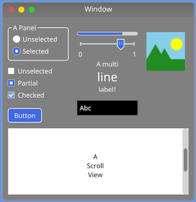

# ImagineUI

An experimental Swift-based UI framework inspired by Apple's Cocoa and Microsoft's System.Windows.Forms.

Sample screenshot, featuring basic controls like buttons, checkboxes, radio buttons, panels, sliders and image views:

